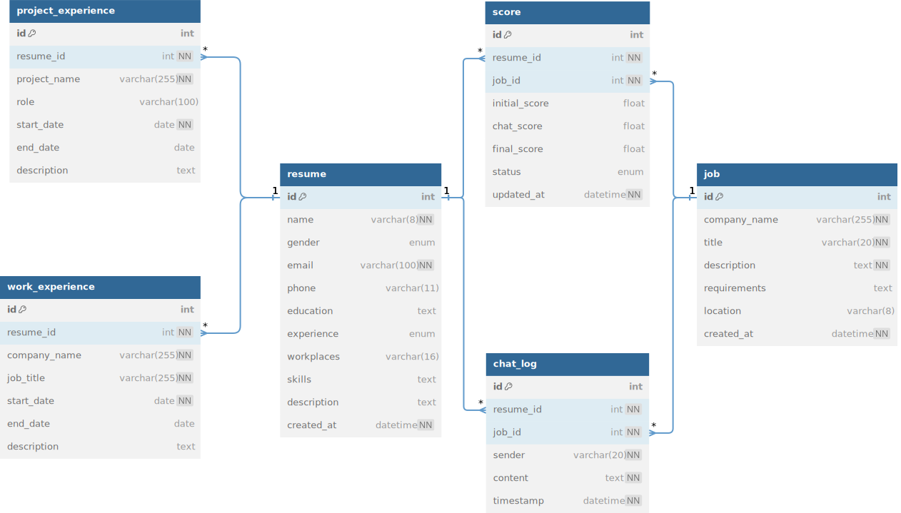

<h2 style="text-align: center;">简历匹配</h2>

### 一. 数据表

> 建立各个数据表的 SQL 代码在 `./database/resume.sql`

#### 表具体信息
- [爬虫](./doc/爬虫.md)
- [匹配](./doc/匹配.md)
- [问答](./doc/问答.md)

#### ER 图




### 二. API

#### 爬虫

```bash
python run_scraper.py -l location -a age
```

#### 监控/回复消息

```python
async def check_new_messages():
	# 调用接口或者自己爬取
    new_messages = [
        ("user123", "Hello from user123!"),
        ("user456", "Hi, this is user456."),
    ]
    return new_messages
```
```python
@app.post("/llm")
async def llm(payload: dict):
	# 包含历史对话记录，岗位信息
    chat_hist = payload["chat_hist"]
	job_info = payload["job_info"]

    return {"response": f"Echo: {chat_hist}|||{job_info}"}
```

#### 排序
#### 生成回复/打分